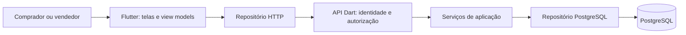

# Arquitetura

Flutter no cliente, Dart/Shelf na API e PostgreSQL no banco. Um repositório com dois aplicativos
independentes facilita a colaboração. Um backend modular único reduz infraestrutura e permite
aprender rotas, identidade, serviços e persistência sem geração de código nesta fase.

PostgreSQL é adequado pelos relacionamentos, transações, restrições e índices: uma proposta
pertence a uma solicitação e um aceite deve originar exatamente um pedido.

| Camada | Responsabilidade |
|---|---|
| Flutter / view | Renderizar, coletar dados e navegar |
| Flutter / view model | Carregamento, erro e ações de tela |
| Flutter / repository | Traduzir HTTP e contratos |
| API / HTTP | Interpretar pedidos, autenticar e responder |
| API / service | Validar regras e autorização |
| API / repository | Persistir e consultar dados |

Dependências são injetadas nos pontos de entrada. Interfaces permitem repositórios em memória
nos testes. ChangeNotifier/ListenableBuilder bastam para o estado inicial. Flutter não calcula
preço oficial nem conecta ao banco. O pacote compartilhado contém apenas contratos públicos.

## Dados e módulos

Implementados: `users` e `quote_requests` em `001_initial.sql`.

Planejados em migrações futuras:

- Identidade: Google verificado no servidor e concessão/revogação de vendedor.
- `materials`: unidade de compra/uso, conversões, custo e vigência.
- `product_templates` e `template_materials`: ficha técnica.
- `pricing_policies`: taxas e versão da política aplicada.
- `proposals`, `proposal_versions`, `proposal_items`: instantâneo de custos e condições;
  versão enviada imutável.
- `orders`: vínculo único com versão aceita, responsável e situação.
- `status_events`: quem alterou, quando e qual transição.
- `attachments`: metadados e referência ao armazenamento; não base64 no banco.

Custos unitários por metro e quantidades fracionárias precisam de `NUMERIC`; totais fechados
em centavos inteiros. Não usar `double` como fonte oficial de dinheiro. Validar a etapa de
arredondamento com a planilha.

## Regras

Já implementadas: comprador cria solicitações; dono/estado inicial são definidos no servidor;
comprador consulta somente seus registros; vendedor precisa de aprovação no serviço.
As identidades atuais são apenas demonstrativas.

Pendentes: envio exige itens, valor, validade e condições; DTO comercial omite custos e margem;
aceite verifica dono/validade/versão; criação de pedido é transacional e idempotente;
mudanças de situação seguem estado anterior, papel e histórico.

A precificação deve ser validada contra `Precificador_SemRateio_Fera_Metalúrgica.xlsx`.
Valores e percentuais do Figma são exemplos, não especificação suficiente para produção.

## Identidade e operação

O verificador Google deverá validar assinatura, emissor, público-alvo, expiração e email verificado;
resolver usuário no banco e verificar aprovação. Papel não vem do Flutter. Enquanto não existe,
o modo padrão usa `DenyAllIdentityVerifier`. Autenticação demonstrativa exige development explícito.

Antes de produção: HTTPS, identidade real, segredos, migrações com rastreamento, backup/restauração,
paginação, controle de requisições, logs sem dados sensíveis e monitoramento. CORS não é autenticação.

Referências: [Flutter](https://docs.flutter.dev/app-architecture/guide),
[Shelf](https://pub.dev/packages/shelf), [PostgreSQL para Dart](https://pub.dev/packages/postgres).
